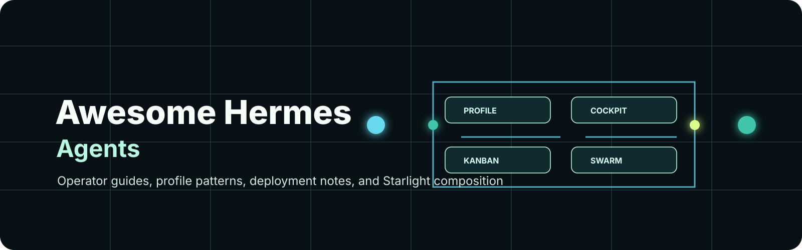

<p align="center">
  
</p>

<h1 align="center">Awesome Hermes Agents</h1>

<p align="center">
  <strong>A curated list of the best Hermes Agent resources from across the web — runtimes, UIs, skills, plugins, memory, multi-agent tools, deploy packs, and operator guides.</strong>
</p>

<p align="center">
  <a href="https://awesome.re"></a>
  <a href="https://github.com/frankxai/awesome-hermes-agents/actions/workflows/link-checker.yml"></a>
  <a href="https://github.com/NousResearch/hermes-agent"></a>
  <a href="LICENSE"></a>
</p>

<p align="center">
  <a href="#contents">Contents</a> ·
  <a href="#official">Official</a> ·
  <a href="#skills--plugins">Skills</a> ·
  <a href="#uis--workspaces">UIs</a> ·
  <a href="#memory--context">Memory</a> ·
  <a href="#tools--ops">Tools</a> ·
  <a href="#multi-agent--swarms">Swarms</a> ·
  <a href="#operator-playbooks-this-repo">Operator docs</a>
</p>

---

> Independent curation by FrankX / Starlight. **Not** an official Nous Research repo.  
> Behavior SSOT: [hermes-agent docs](https://hermes-agent.nousresearch.com/docs/) · [NousResearch/hermes-agent](https://github.com/NousResearch/hermes-agent)

**What this list is:** classic [awesome](https://awesome.re) style — high-signal projects **from the whole ecosystem**, not a funnel into our own products.

**Split with the skills list**

| List | Focus |
| --- | --- |
| **This repo** | Agents, UIs, tools, memory, multi-agent, deploy, operator patterns |
| **[awesome-hermes-agent-skills](https://github.com/frankxai/awesome-hermes-agent-skills)** | Deep skills catalog (web-wide packs + free packs we maintain) |

Other excellent independent directories (use them too):

- [0xNyk/awesome-hermes-agent](https://github.com/0xNyk/awesome-hermes-agent) (~4.7k★) — large skills/plugins/tools directory  
- [SamurAIGPT/awesome-hermes-agent](https://github.com/SamurAIGPT/awesome-hermes-agent) (~1.8k★) — skills, plugins, maturity tags  

Research pulse: **2026-08-30**. Stars are approximate; prefer maintenance + docs over vanity stars.

Skills for agents live in **[awesome-hermes-agent-skills](https://github.com/frankxai/awesome-hermes-agent-skills)** — including the [earned-skill doctrine](https://github.com/frankxai/awesome-hermes-agent-skills/blob/main/docs/EARNED-SKILLS.md) (about 5–7 named workflows, not 500) and the [quality & safety gate](https://github.com/frankxai/awesome-hermes-agent-skills/blob/main/docs/QUALITY-AND-SAFETY.md) (read source, license, NVIDIA SkillSpector, no unsigned ZIPs, no wallet skills without a human spend gate).

---

## Contents

- [Official](#official)
- [Skills & plugins](#skills--plugins)
- [UIs & workspaces](#uis--workspaces)
- [Memory & context](#memory--context)
- [Tools & ops](#tools--ops)
- [Multi-agent & swarms](#multi-agent--swarms)
- [Deploy & hosting](#deploy--hosting)
- [Domain applications](#domain-applications)
- [Learning & guides](#learning--guides)
- [Operator playbooks (this repo)](#operator-playbooks-this-repo)
- [Related awesome lists](#related-awesome-lists)
- [Contributing](#contributing)

---

## Official

| Project | Notes |
| --- | --- |
| [NousResearch/hermes-agent](https://github.com/NousResearch/hermes-agent) | Core runtime — profiles, skills, Kanban, messaging gateway, backends |
| [Official docs](https://hermes-agent.nousresearch.com/docs/) | Install, config, skills, Kanban, security, MCP, cron |
| [Nous Portal](https://portal.nousresearch.com/) | Official models + Tool Gateway |
| [agentskills.io](https://agentskills.io) | Cross-agent skill standard (Hermes-compatible) |
| [autonovel](https://github.com/NousResearch/autonovel) | Long-form writing pipeline on Hermes |
| [hermes-agent-self-evolution](https://github.com/NousResearch/hermes-agent-self-evolution) | DSPy + GEPA self-improvement research |
| [hermes-paperclip-adapter](https://github.com/NousResearch/hermes-paperclip-adapter) | Hermes as managed Paperclip worker |
| [tinker-atropos](https://github.com/NousResearch/tinker-atropos) | RL / trajectory training infrastructure |
| [Discord](https://discord.gg/NousResearch) | Community |

Key docs: [Profiles](https://hermes-agent.nousresearch.com/docs/user-guide/profiles) · [Kanban](https://hermes-agent.nousresearch.com/docs/user-guide/features/kanban) · [Skills](https://hermes-agent.nousresearch.com/docs/user-guide/features/skills) · [Creating skills](https://hermes-agent.nousresearch.com/docs/developer-guide/creating-skills)

---

## Skills & plugins

> Full web-wide skills table lives in **[awesome-hermes-agent-skills](https://github.com/frankxai/awesome-hermes-agent-skills)**. Highlights below so this agents list stays useful standalone.

### Earned operator stack (install these, not everything)

| Project | Why |
| --- | --- |
| [agentskills.io](https://agentskills.io) / [agentskills/agentskills](https://github.com/agentskills/agentskills) | Portable `SKILL.md` spec |
| [anthropics/skills](https://github.com/anthropics/skills) | Official named examples — not a bulk dump |
| [obra/superpowers](https://github.com/obra/superpowers) | TDD / debug / review methodology (~280k★, 2026-08-30) |
| [garrytan/gstack](https://github.com/garrytan/gstack) | Product + design + QA loops (~130k★) |
| [NVIDIA/SkillSpector](https://github.com/NVIDIA/SkillSpector) | Scan a skill before it runs |
| [addyosmani/agent-skills](https://github.com/addyosmani/agent-skills) | Production engineering skills |

### Start with these (Hermes-native ecosystem)

| Project | Why |
| --- | --- |
| [wondelai/skills](https://github.com/wondelai/skills) | Broad agentskills.io library for Hermes + Claude Code + others (~1.6k★) |
| [Romanescu11/hermes-skill-factory](https://github.com/Romanescu11/hermes-skill-factory) | Meta-skill: turn real workflows into reusable skills |
| [42-evey/hermes-plugins](https://github.com/42-evey/hermes-plugins) | Goals, inter-agent bridge, model selection, cost control |
| [tlehman/litprog-skill](https://github.com/tlehman/litprog-skill) | Literate programming across Hermes / Claude Code / OpenCode |
| [Cranot/super-hermes](https://github.com/Cranot/super-hermes) | Skills that teach Hermes to write better analytical prompts |
| [witt3rd/oh-my-hermes](https://github.com/witt3rd/oh-my-hermes) | Multi-agent orchestration skills (research → plan → verified exec) |
| [markoblogo/abvx-agent-skills](https://github.com/markoblogo/abvx-agent-skills) | Small auditable coding-agent skillpack (diffs, evidence, review) |
| [AMAP-ML/SkillClaw](https://github.com/AMAP-ML/SkillClaw) | Auto-evolve / dedupe skill libraries from session data |
| [mukul975/Anthropic-Cybersecurity-Skills](https://github.com/mukul975/Anthropic-Cybersecurity-Skills) | Huge MITRE-mapped security skill set (agentskills.io) |
| [black-forest-labs/skills](https://github.com/black-forest-labs/skills) | Official FLUX image skills |
| [Agents365-ai/drawio-skill](https://github.com/Agents365-ai/drawio-skill) | draw.io diagrams from NL; works on Hermes |
| [CorpusIQ/corpusiq-docs](https://github.com/CorpusIQ/corpusiq-docs) | Business ops skill library + many MCP connectors |
| [longbridge/skills](https://github.com/longbridge/skills) | Markets / portfolio skills (HK/US/A-share/SG) |
| [ZeroPointRepo/youtube-skills](https://github.com/ZeroPointRepo/youtube-skills) | YouTube search + robust transcripts |

**Browse more:** [awesome-hermes-agent-skills](https://github.com/frankxai/awesome-hermes-agent-skills) · [0xNyk](https://github.com/0xNyk/awesome-hermes-agent) · [SamurAIGPT](https://github.com/SamurAIGPT/awesome-hermes-agent)

### Maintained here (small open-core set — optional)

FrankX free packs are **not** the center of this list; they are one more option:

| Pack | Repo |
| --- | --- |
| `coding-agents-superpack`, `todo-discipline` | [awesome-hermes-agent-skills/skills](https://github.com/frankxai/awesome-hermes-agent-skills/tree/main/skills) |

---

## UIs & workspaces

| Project | Notes |
| --- | --- |
| [nesquena/hermes-webui](https://github.com/nesquena/hermes-webui) | Popular web + phone UI (~16k★) |
| [EKKOLearnAI/hermes-studio](https://github.com/EKKOLearnAI/hermes-studio) | Full dashboard: chat, jobs, analytics, multi-profile (~9k★) |
| [outsourc-e/hermes-workspace](https://github.com/outsourc-e/hermes-workspace) | Chat, terminal, memory, skills manager, inspector (~6k★) |
| [fathah/hermes-desktop](https://github.com/fathah/hermes-desktop) | Desktop companion |
| [dodo-reach/hermes-desktop](https://github.com/dodo-reach/hermes-desktop) | Mac-first pure SSH management — no extra gateway (~2k★) |
| [farion1231/cc-switch](https://github.com/farion1231/cc-switch) | Multi-CLI desktop including Hermes |
| [iOfficeAI/AionUi](https://github.com/iOfficeAI/AionUi) | Local 24/7 cowork across many CLIs |
| [qingchencloud/clawpanel](https://github.com/qingchencloud/clawpanel) | Multi-engine panel (OpenClaw + Hermes) |
| [pyrate-llama/hermes-ui](https://github.com/pyrate-llama/hermes-ui) | Single-file glassmorphic web UI |

---

## Memory & context

| Project | Notes |
| --- | --- |
| [garrytan/gbrain](https://github.com/garrytan/gbrain) | Opinionated OpenClaw/Hermes brain layer (~26k★) |
| [mnemosyne-oss/mnemosyne](https://github.com/mnemosyne-oss/mnemosyne) | Zero-dep sub-ms memory system for Hermes + others |
| [colbymchenry/codegraph](https://github.com/colbymchenry/codegraph) | Local code knowledge graph for coding agents + Hermes |
| [screenpipe/screenpipe](https://github.com/screenpipe/screenpipe) | Local continuous screen/audio context + MCP |
| [yoloshii/ClawMem](https://github.com/yoloshii/ClawMem) | On-device memory layer |
| [greyhaven-ai/autocontext](https://github.com/greyhaven-ai/autocontext) | Self-curating context harness |
| [penfieldlabs/hermes-penfield](https://github.com/penfieldlabs/hermes-penfield) | Memory provider for Penfield knowledge graph |

---

## Tools & ops

| Project | Notes |
| --- | --- |
| [builderz-labs/mission-control](https://github.com/builderz-labs/mission-control) | Self-hosted fleet control plane: dispatch, review, spend (~5.7k★) |
| [jo-inc/camofox-browser](https://github.com/jo-inc/camofox-browser) | Stealth headless browser used with Hermes browser automation |
| [mnfst/manifest](https://github.com/mnfst/manifest) | Connect harnesses to providers |
| [liaohch3/claude-tap](https://github.com/liaohch3/claude-tap) | Intercept/inspect coding-agent + Hermes API traffic |
| [fkiene/llmtrim](https://github.com/fkiene/llmtrim) | Local proxy that trims tool schemas/history before model calls |
| [luoyuctl/agenttrace](https://github.com/luoyuctl/agenttrace) | Local TUI session audits (cost, retries, health) |
| [Socialpranker/agentburn](https://github.com/Socialpranker/agentburn) | Read-only spend profiler for Hermes instances |
| [masterlf/hermes-ai-usage](https://github.com/masterlf/hermes-ai-usage) | Read-only provider quota and per-profile token telemetry for Hermes Desktop and Web Dashboard; keeps provider quota distinct from local usage and does not read prompt content. |
| [0xrsydn/nix-hermes-agent](https://github.com/0xrsydn/nix-hermes-agent) | Nix package + NixOS module |
| [42-evey/evey-setup](https://github.com/42-evey/evey-setup) | One-command stack setup with plugins |
| [unitedideas/nothumansearch-mcp](https://github.com/unitedideas/nothumansearch-mcp) | MCP for discovering other MCP servers |

---

## Multi-agent & swarms

| Project | Notes |
| --- | --- |
| Official [Kanban](https://hermes-agent.nousresearch.com/docs/user-guide/features/kanban) | Durable multi-profile board (built-in) |
| [witt3rd/oh-my-hermes](https://github.com/witt3rd/oh-my-hermes) | Orchestration skill stack on Hermes primitives |
| [builderz-labs/mission-control](https://github.com/builderz-labs/mission-control) | Fleet ops dashboard |
| [jnMetaCode/agency-agents-zh](https://github.com/jnMetaCode/agency-agents-zh) | Large expert-role pack + orchestrator (Hermes among targets) |
| [Ikalus1988/MisakaNet](https://github.com/Ikalus1988/MisakaNet) | Git-based distributed swarm memory |
| [Abruptive/Ankh.md](https://github.com/Abruptive/Ankh.md) | Multi-agent swarm framework experiments |
| [Rainhoole/hermes-agent-acp-skill](https://github.com/Rainhoole/hermes-agent-acp-skill) | Delegate across Hermes / Codex / Claude Code |

---

## Deploy & hosting

| Project / guide | Notes |
| --- | --- |
| Official messaging deploy notes | [Telegram](https://hermes-agent.nousresearch.com/docs/user-guide/messaging/telegram) (Fly/Railway/Render) · [WhatsApp Cloud](https://hermes-agent.nousresearch.com/docs/user-guide/messaging/whatsapp-cloud) (Cloudflare Tunnel) |
| [Railway multi-agent guide](https://docs.railway.com/guides/multi-agent-system) | One service per agent pattern |
| [xmbshwll/hermes-agent-docker](https://github.com/xmbshwll/hermes-agent-docker) | Minimal Docker sandbox |
| [solomon2773/nora](https://github.com/solomon2773/nora) | Self-hosted control plane for Hermes/OpenClaw on Docker/K8s |
| [JackTheGit/hermes-autonomous-server](https://github.com/JackTheGit/hermes-autonomous-server) | Headless systemd + cron server |

In-repo deploy templates: [`templates/deploy/`](templates/deploy/) · [docs/deployment-matrix.md](docs/deployment-matrix.md)

---

## Domain applications

| Project | Domain |
| --- | --- |
| [Lethe044/hermes-incident-commander](https://github.com/Lethe044/hermes-incident-commander) | SRE / self-healing incidents |
| [Lethe044/hermes-life-os](https://github.com/Lethe044/hermes-life-os) | Personal OS / life patterns |
| [Yonkoo11/hermes-dojo](https://github.com/Yonkoo11/hermes-dojo) | Skill self-improvement loop |
| [Christabel337/job-scout-agent](https://github.com/Christabel337/job-scout-agent) | Job search pipeline |
| [longsizhuo/openInvest](https://github.com/longsizhuo/openInvest) | Investment research (not financial advice) |
| [bbolinger/snapmaker-u1-toolkit](https://github.com/bbolinger/snapmaker-u1-toolkit) | 3D printer safety-staged automation |
| [setasoma/mycodo-hermes-skill](https://github.com/setasoma/mycodo-hermes-skill) | IoT mushroom cultivation |

Structured **skill** indexes by domain (web-first, quality-gated):

| Domain | List |
| --- | --- |
| Skills hub | [awesome-hermes-agent-skills](https://github.com/frankxai/awesome-hermes-agent-skills) |
| Design | [awesome-design-agent-skills](https://github.com/frankxai/awesome-design-agent-skills) |
| Motion / video | [awesome-motion-design-agent-skills](https://github.com/frankxai/awesome-motion-design-agent-skills) |
| Music | [awesome-music-agent-skills](https://github.com/frankxai/awesome-music-agent-skills) |
| Payments | [awesome-payment-agent-skills](https://github.com/frankxai/awesome-payment-agent-skills) |
| Automation | [awesome-automation-agent-skills](https://github.com/frankxai/awesome-automation-agent-skills) |
| Game (upstream) | [gamedev-skills/awesome-gamedev-agent-skills](https://github.com/gamedev-skills/awesome-gamedev-agent-skills) |

---

## Learning & guides

| Resource | Notes |
| --- | --- |
| [Official quickstart](https://hermes-agent.nousresearch.com/docs/getting-started/quickstart) | Start here |
| [mudrii/hermes-agent-docs](https://github.com/mudrii/hermes-agent-docs) | Community docs supplement |
| [LearnPrompt/LearnPrompt](https://github.com/LearnPrompt/LearnPrompt) | Free AIGC course covering Hermes among others |
| YouTube: Profiles & Kanban masterclass | Search “Hermes Agent Masterclass Profiles Kanban” (community) |

---

## Operator playbooks (this repo)

These are **our** opinionated founder/operator notes — optional, on top of the ecosystem list above.

| Doc | Purpose |
| --- | --- |
| [GETTING_STARTED.md](GETTING_STARTED.md) | Hermes-first onboarding |
| [docs/operator-decision-guide.md](docs/operator-decision-guide.md) | Local vs Railway vs Vercel vs enterprise |
| [docs/architecture.md](docs/architecture.md) | Profile-first armies + claim discipline |
| [docs/deployment-matrix.md](docs/deployment-matrix.md) | Where Hermes should live |
| [docs/codex-control-plane.md](docs/codex-control-plane.md) | Git-desired-state fleets |
| [docs/provenance-and-naming.md](docs/provenance-and-naming.md) | Hermes Agent ≠ Hermes models |
| [docs/managed-offerings.md](docs/managed-offerings.md) | Portal, adjacent products |
| [examples/starlight-swarm-topology.md](examples/starlight-swarm-topology.md) | Example roles |
| [`configs/starlight-hermes-swarm.example.json`](configs/starlight-hermes-swarm.example.json) | Machine-readable example |
| [`scripts/hermes-swarm.ps1`](scripts/hermes-swarm.ps1) | list / emit-local / doctor |
| [docs/sources.md](docs/sources.md) | Source index |

```powershell
powershell -NoProfile -ExecutionPolicy Bypass -File .\scripts\hermes-swarm.ps1 doctor
```

---

## Related awesome lists

| List | Focus |
| --- | --- |
| [0xNyk/awesome-hermes-agent](https://github.com/0xNyk/awesome-hermes-agent) | Broad ecosystem directory |
| [SamurAIGPT/awesome-hermes-agent](https://github.com/SamurAIGPT/awesome-hermes-agent) | Skills/plugins with maturity tags |
| [frankxai/awesome-hermes-agent-skills](https://github.com/frankxai/awesome-hermes-agent-skills) | Skills-focused companion (web + free packs) |
| [frankxai/awesome-agent-operating-systems](https://github.com/frankxai/awesome-agent-operating-systems) | Broader agent OS landscape |
| [SamurAIGPT/awesome-openclaw](https://github.com/SamurAIGPT/awesome-openclaw) | OpenClaw (migration path to Hermes) |

### FrankX domain lists (optional)

[agentic-income](https://github.com/frankxai/awesome-agentic-income) · [automation skills](https://github.com/frankxai/awesome-automation-agent-skills) · [design skills](https://github.com/frankxai/awesome-design-agent-skills) · [music skills](https://github.com/frankxai/awesome-music-agent-skills) · [ai-coe](https://github.com/frankxai/awesome-ai-coe)

---

## Contributing

1. Prefer **external, high-quality** links with a one-line *why*.  
2. Skills → prefer PR to [awesome-hermes-agent-skills](https://github.com/frankxai/awesome-hermes-agent-skills) if the entry is skill-pack only; agents/UIs/tools/ops can land here.  
3. No hallucinated tools. No secret dumps. See [CONTRIBUTING.md](CONTRIBUTING.md) · [SECURITY.md](SECURITY.md).

---

## License

[MIT](LICENSE)

---

<p align="center">
  Curated by <a href="https://github.com/frankxai">frankxai</a>
  · Runtime by <a href="https://github.com/NousResearch/hermes-agent">Nous Research</a>
  · Skills companion: <a href="https://github.com/frankxai/awesome-hermes-agent-skills">awesome-hermes-agent-skills</a>
  · Pulse: <strong>2026-07-16</strong>
</p>
