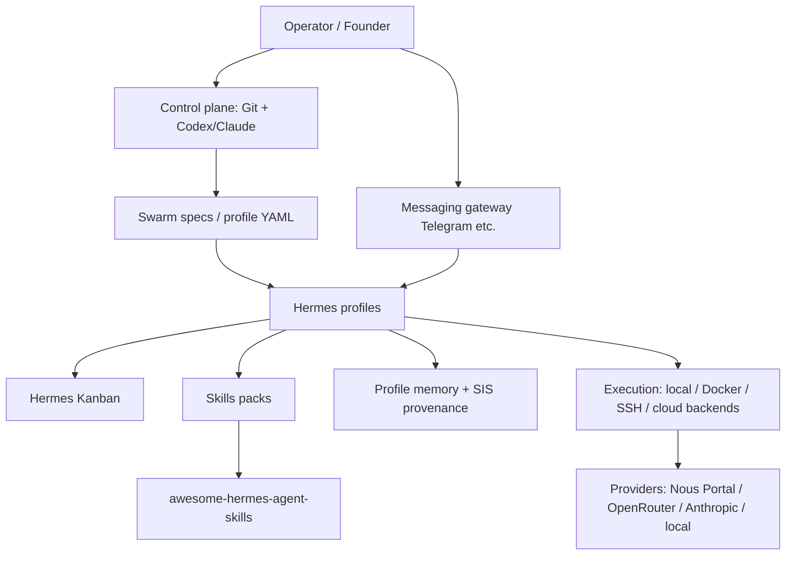

<p align="center">
  
</p>

<h1 align="center">✦ Awesome Hermes Agents</h1>

<p align="center">
  <strong>The operator playbook for <a href="https://github.com/NousResearch/hermes-agent">Hermes Agent</a> — profiles, Kanban swarms, deploy matrices, control planes, and Starlight composition.</strong>
</p>

<p align="center">
  <a href="https://awesome.re"></a>
  <a href="https://github.com/frankxai/awesome-hermes-agents/actions/workflows/link-checker.yml"></a>
  <a href="https://github.com/NousResearch/hermes-agent"></a>
  <a href="LICENSE"></a>
  <a href="https://frankx.ai"></a>
</p>

<p align="center">
  <a href="#-start-here">Start Here</a> ·
  <a href="#-agents-vs-skills">Agents vs Skills</a> ·
  <a href="#-official">Official</a> ·
  <a href="#-curated-ecosystem">Ecosystem</a> ·
  <a href="#-operator-docs">Operator Docs</a> ·
  <a href="#-deploy">Deploy</a> ·
  <a href="#-companion-repos">Companions</a>
</p>

---

> **Independent FrankX / Starlight curation — not an official Nous Research repository.**  
> Official behavior SSOT: [Hermes Agent docs](https://hermes-agent.nousresearch.com/docs/) · [NousResearch/hermes-agent](https://github.com/NousResearch/hermes-agent)  
> Disclosure: product names and trademarks belong to their respective owners. See [provenance](docs/provenance-and-naming.md).

---

## ✦ Agents vs Skills (read this first)

There are **two** FrankX lists for Hermes. They are not duplicates.

| Repo | Role | Put here |
| --- | --- | --- |
| **[awesome-hermes-agents](https://github.com/frankxai/awesome-hermes-agents)** ← *you are here* | **Agents / ops / runtime** | Profiles, Kanban, deploy, control plane, dashboards, swarm topology, operator decision guides, architecture |
| **[awesome-hermes-agent-skills](https://github.com/frankxai/awesome-hermes-agent-skills)** | **Skills / packs / portfolio OS** | `SKILL.md` packs, free vs gated classification, publish playbook, skill portfolio maintenance |

```text
Hermes Agent runtime  →  this repo (how you run agents)
Reusable procedures   →  awesome-hermes-agent-skills (what agents load)
```

**Sibling community lists** (ecosystem index, different editorial voice):

- [0xNyk/awesome-hermes-agent](https://github.com/0xNyk/awesome-hermes-agent) — broad skills/plugins/tools directory  
- [SamurAIGPT/awesome-hermes-agent](https://github.com/SamurAIGPT/awesome-hermes-agent) — community curated skills & integrations  

This repo’s edge: **founder operator playbooks**, **Starlight control-plane patterns**, **deploy matrices**, **profile armies**, and **executable swarm configs** — not another undifferentiated link dump.

---

## ✦ Start Here

| Need | Go |
| --- | --- |
| Install Hermes | [Official installation](https://hermes-agent.nousresearch.com/docs/getting-started/installation) · [Quickstart](https://hermes-agent.nousresearch.com/docs/getting-started/quickstart) |
| Windows desktop / local | [Local Windows Setup](docs/local-windows-setup.md) · [Official Windows native](https://hermes-agent.nousresearch.com/docs/user-guide/windows-native) |
| First multi-agent setup | [Operator Decision Guide](docs/operator-decision-guide.md) · [Architecture](docs/architecture.md) · [Kanban tutorial](https://hermes-agent.nousresearch.com/docs/user-guide/features/kanban-tutorial) |
| Deploy off-laptop | [Deployment Matrix](docs/deployment-matrix.md) · `templates/deploy/` |
| Load skills | **[awesome-hermes-agent-skills](https://github.com/frankxai/awesome-hermes-agent-skills)** · [Creating skills](https://hermes-agent.nousresearch.com/docs/developer-guide/creating-skills) |
| Swarm config example | [`configs/starlight-hermes-swarm.example.json`](configs/starlight-hermes-swarm.example.json) · [`scripts/hermes-swarm.ps1`](scripts/hermes-swarm.ps1) |

### Minimal profile army

```bash
hermes profile create conductor
hermes profile create coder
hermes profile create researcher
hermes profile create publisher

# Durable multi-agent board (shared across profiles)
hermes kanban
# or open the web dashboard sessions view after `hermes dashboard`
```

Use **profiles as durable identities** (own config, memory, skills, gateway). Use **Kanban** for durable task state. Do not fake “swarms” as anonymous port clones.

---

## ✦ What “Hermes” means

| Term | What it is |
| --- | --- |
| **Hermes Agent** | Open-source agent framework by [Nous Research](https://github.com/NousResearch/hermes-agent) |
| **Hermes models** | Model lineage (e.g. Hermes 3) — not the same as the Agent runtime |
| **Nous Portal / Tool Gateway** | Official model + hosted tool routing |
| **Starlight Hermes pattern** | FrankX composition: profiles, skills, SIS memory/provenance, Codex-managed config |
| **Higgsfield Supercomputer** | Adjacent managed creative product — **not** hosted Hermes Agent unless they document it |

---

## ✦ Official

| Resource | Notes |
| --- | --- |
| [NousResearch/hermes-agent](https://github.com/NousResearch/hermes-agent) | Core runtime — profiles, skills, Kanban, gateway, backends |
| [Official docs](https://hermes-agent.nousresearch.com/docs/) | Install, config, messaging, security, MCP, cron, skills |
| [Profiles](https://hermes-agent.nousresearch.com/docs/user-guide/profiles) | Isolated multi-instance agents on one host |
| [Kanban](https://hermes-agent.nousresearch.com/docs/user-guide/features/kanban) | Durable multi-profile task board |
| [Skills](https://hermes-agent.nousresearch.com/docs/user-guide/features/skills) | Procedural memory / `SKILL.md` |
| [Desktop](https://hermes-agent.nousresearch.com/docs/user-guide/desktop) | Native desktop app |
| [Web dashboard](https://hermes-agent.nousresearch.com/docs/user-guide/features/web-dashboard) | Local ops UI |
| [Nous Portal](https://portal.nousresearch.com/) | Official provider + Tool Gateway path |
| [autonovel](https://github.com/NousResearch/autonovel) | Long-form writing pipeline on Hermes |
| [hermes-agent-self-evolution](https://github.com/NousResearch/hermes-agent-self-evolution) | DSPy + GEPA self-improvement research |
| [hermes-paperclip-adapter](https://github.com/NousResearch/hermes-paperclip-adapter) | Hermes as managed worker in Paperclip |
| [agentskills.io](https://agentskills.io) | Cross-agent skill standard |

Source index (expanded): [docs/sources.md](docs/sources.md)

---

## ✦ Curated ecosystem

Stars are approximate snapshots (research pulse **2026-07-16**). Prefer **official docs + maturity** over star count alone.

### UIs, workspaces, multi-agent surfaces

| Project | Why it matters |
| --- | --- |
| [nesquena/hermes-webui](https://github.com/nesquena/hermes-webui) | Popular web/phone UI for Hermes |
| [EKKOLearnAI/hermes-studio](https://github.com/EKKOLearnAI/hermes-studio) | Dashboard: chat, sessions, jobs, analytics |
| [outsourc-e/hermes-workspace](https://github.com/outsourc-e/hermes-workspace) | Native workspace: chat, terminal, memory, skills, inspector |
| [fathah/hermes-desktop](https://github.com/fathah/hermes-desktop) | Desktop companion |
| [farion1231/cc-switch](https://github.com/farion1231/cc-switch) | Multi-CLI desktop (Claude Code, Codex, OpenCode, Hermes, …) |
| [iOfficeAI/AionUi](https://github.com/iOfficeAI/AionUi) | Local 24/7 cowork shell across many CLIs including Hermes |

### Memory, knowledge, harness bridges

| Project | Why it matters |
| --- | --- |
| [garrytan/gbrain](https://github.com/garrytan/gbrain) | Opinionated OpenClaw/Hermes “brain” patterns |
| [colbymchenry/codegraph](https://github.com/colbymchenry/codegraph) | Local code knowledge graph for coding agents + Hermes |
| [mnfst/manifest](https://github.com/mnfst/manifest) | Connect agents/harnesses to providers |
| [screenpipe/screenpipe](https://github.com/screenpipe/screenpipe) | Local continuous context; Hermes/OpenClaw integrations |

### Skills & related awesome lists

| Project | Role |
| --- | --- |
| **[frankxai/awesome-hermes-agent-skills](https://github.com/frankxai/awesome-hermes-agent-skills)** | **Our skills SSOT** + Skill Portfolio OS + free packs |
| [0xNyk/awesome-hermes-agent](https://github.com/0xNyk/awesome-hermes-agent) | Large independent directory |
| [SamurAIGPT/awesome-hermes-agent](https://github.com/SamurAIGPT/awesome-hermes-agent) | Community skills/plugins index |
| [agentskills.io](https://agentskills.io) | Portable skill standard |

### Operator patterns in *this* repo

| Path | Purpose |
| --- | --- |
| [docs/architecture.md](docs/architecture.md) | Layers: operator → control → profile → Kanban → memory → execution |
| [docs/operator-decision-guide.md](docs/operator-decision-guide.md) | Local vs Railway vs Vercel vs enterprise |
| [docs/deployment-matrix.md](docs/deployment-matrix.md) | Where Hermes should (and should not) live |
| [docs/codex-control-plane.md](docs/codex-control-plane.md) | Git-desired-state for fleets |
| [docs/managed-offerings.md](docs/managed-offerings.md) | Portal, adjacent products, bridges |
| [examples/starlight-swarm-topology.md](examples/starlight-swarm-topology.md) | Conductor / coder / researcher / publisher / sentinel |
| [docs/gencreator-swarm-dashboard.html](docs/gencreator-swarm-dashboard.html) | Interactive swarm dashboard (open in browser) |
| `skills/arcanea-image-gen/` | Draft creative media skill (Arcanea router) — expand carefully |

---

## ✦ Operator docs

| Doc | Purpose |
| --- | --- |
| [Local Windows Setup](docs/local-windows-setup.md) | Working Windows CLI / dashboard / Electron notes |
| [Operator Decision Guide](docs/operator-decision-guide.md) | Topology choices |
| [Architecture Pattern](docs/architecture.md) | Profile-first armies + Starlight claims discipline |
| [Deployment Matrix](docs/deployment-matrix.md) | Local / VPS / Railway / Vercel / Cloudflare / Docker |
| [Codex Control Plane](docs/codex-control-plane.md) | Config generation & review loops |
| [Provenance and Naming](docs/provenance-and-naming.md) | Attribution rules (hard) |
| [Managed Offerings](docs/managed-offerings.md) | Portal, LiteLLM bridge, NemoClaw, etc. |
| [Roadmap](docs/roadmap.md) | Next compiler / compose / provenance linter |
| [Sources](docs/sources.md) | Checked primary links |

### Validate local swarm emit

```powershell
powershell -NoProfile -ExecutionPolicy Bypass -File .\scripts\hermes-swarm.ps1 list
powershell -NoProfile -ExecutionPolicy Bypass -File .\scripts\hermes-swarm.ps1 emit-local
powershell -NoProfile -ExecutionPolicy Bypass -File .\scripts\hermes-swarm.ps1 doctor
```

---

## ✦ Deploy

| Target | Use for | Avoid |
| --- | --- | --- |
| **Local** | Coding, files, MCP, dashboard on `127.0.0.1` | Public dashboards without auth |
| **Railway / Fly / Render / VPS** | Always-on workers, messaging gateways | Cramming full fleets into one opaque process |
| **Vercel** | Control panels, docs, enqueue APIs | Long-running shell agents in serverless handlers |
| **Cloudflare Tunnel + Access** | Secure edge to local/stateful workers | Assuming Workers = full Hermes home |
| **Docker** | Repeatable profile isolation + volumes | Ephemeral containers without `HERMES_HOME` volume |

Templates: [`templates/deploy/`](templates/deploy/)

---

## ✦ Companion repos (FrankX)

| Repo | Purpose |
| --- | --- |
| **[awesome-hermes-agent-skills](https://github.com/frankxai/awesome-hermes-agent-skills)** | Skills packs + Skill Portfolio OS |
| [awesome-agent-operating-systems](https://github.com/frankxai/awesome-agent-operating-systems) | Broader agent OS / MCP / harness index |
| [agentic-architecture-field-guide](https://github.com/frankxai/agentic-architecture-field-guide) | Vendor-neutral architecture choices |
| [hermes-cockpit](https://github.com/frankxai/hermes-cockpit) | Profile registry / cockpit experiments |
| [agentic-ops-hub](https://github.com/frankxai/agentic-ops-hub) | Open-core multi-machine / bus doctrine |
| [agentic-creator-os](https://github.com/frankxai/agentic-creator-os) | Creator OS open core |

### Full FrankX awesome suite

| List | Focus |
| --- | --- |
| [awesome-hermes-agents](https://github.com/frankxai/awesome-hermes-agents) | **This repo** — Hermes agents & ops |
| [awesome-hermes-agent-skills](https://github.com/frankxai/awesome-hermes-agent-skills) | Hermes skills & portfolio OS |
| [awesome-agent-operating-systems](https://github.com/frankxai/awesome-agent-operating-systems) | Agent OS landscape |
| [awesome-agentic-income](https://github.com/frankxai/awesome-agentic-income) | Agentic income systems |
| [awesome-ai-coe](https://github.com/frankxai/awesome-ai-coe) | AI Center of Excellence |
| [awesome-automation-agent-skills](https://github.com/frankxai/awesome-automation-agent-skills) | Loops, cron, kanban, fleet ops |
| [awesome-design-agent-skills](https://github.com/frankxai/awesome-design-agent-skills) | Design agents |
| [awesome-music-agent-skills](https://github.com/frankxai/awesome-music-agent-skills) | Music agents |
| [awesome-motion-design-agent-skills](https://github.com/frankxai/awesome-motion-design-agent-skills) | Motion design |
| [awesome-wealth-agent-skills](https://github.com/frankxai/awesome-wealth-agent-skills) | Wealth agents |
| [awesome-investor-agent-skills](https://github.com/frankxai/awesome-investor-agent-skills) | Investor agents |
| [awesome-gamification-agent-skills](https://github.com/frankxai/awesome-gamification-agent-skills) | Gamification |
| [awesome-cosmos-ai-agents](https://github.com/frankxai/awesome-cosmos-ai-agents) | Cosmos / space agents |
| [awesome-manifestation-skills](https://github.com/frankxai/awesome-manifestation-skills) | Manifestation skills |
| [awesome-mind-agent-skills](https://github.com/frankxai/awesome-mind-agent-skills) | Mind / cognition skills |

---

## ✦ Recommended architecture (Starlight)



**Hard rules**

1. Desired state in Git; runtime state (`HERMES_HOME`, sessions, memories, tokens) **never** in public git.  
2. One durable profile per role — not anonymous clones.  
3. Skills are portable procedures → publish/sanitize via the **skills** repo.  
4. Claims must not confuse Hermes Agent ↔ Hermes models ↔ Portal ↔ third-party “managed Hermes”.

---

## ✦ Repo structure

```text
awesome-hermes-agents/
├── assets/                 # hero.svg / hero.png
├── configs/                # starlight-hermes-swarm.example.json
├── docs/                   # operator guides + swarm dashboard HTML
├── examples/               # topology narratives
├── scripts/                # hermes-swarm.ps1
├── skills/                 # sparse draft skills (prefer skills repo for packs)
├── templates/
│   ├── agents/             # profile spec shape
│   └── deploy/             # Railway / Vercel / Cloudflare examples
├── GETTING_STARTED.md
├── CONTRIBUTING.md
└── SECURITY.md
```

Documentation-first, with just enough executable surface to **list / emit / doctor** a swarm topology.

---

## ✦ Contributing

- Hermes-**agent / ops** patterns → PRs here.  
- Hermes-**skills** / `SKILL.md` packs → [awesome-hermes-agent-skills](https://github.com/frankxai/awesome-hermes-agent-skills).  
- Broader agent OS links → [awesome-agent-operating-systems](https://github.com/frankxai/awesome-agent-operating-systems).  
- See [CONTRIBUTING.md](CONTRIBUTING.md) · [SECURITY.md](SECURITY.md) · [provenance](docs/provenance-and-naming.md).

**Quality bar:** no hallucinated tools; high-signal only; explain *why* an entry belongs; link primary sources.

---

## ✦ License

[MIT](LICENSE) — FrankX / Starlight Intelligence

---

<p align="center">
  Built by <a href="https://github.com/frankxai">frankxai</a>
  · Powered by <a href="https://github.com/NousResearch/hermes-agent">Nous Research Hermes Agent</a>
  · Skills companion: <a href="https://github.com/frankxai/awesome-hermes-agent-skills">awesome-hermes-agent-skills</a>
  · Last research pulse: <strong>2026-07-16</strong>
</p>
